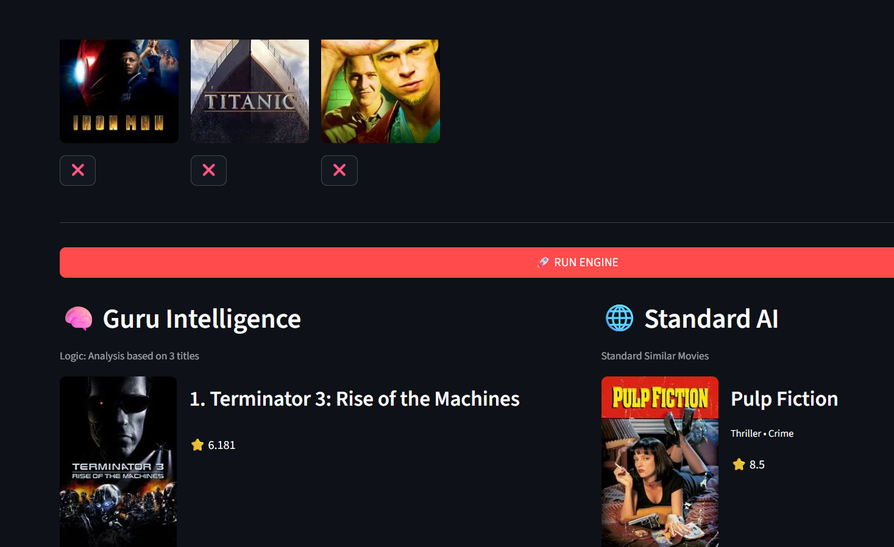

# 🎬 Movie Guru Serg Pro


> **"Where engineering meets cinema. A hybrid recommendation engine powered by real-time data."**

## 🚀 About The Project

**Movie Guru Serg Pro** is not just another movie database; it is a **Hybrid Recommendation System** designed to solve the *Cold Start Problem* often found in streaming platforms.

This project moves beyond static datasets by integrating **real-time API calls** with a custom-built **"Super-Fan" algorithm** to deliver highly personalized suggestions.

### 🌟 Key Features
* **🐍 Custom "Super-Fan" Engine (Collaborative Filtering):** Analyzes user ratings to find "Super Fans" of a specific movie and recommends what *they* loved. It mimics human-to-human recommendation logic.
* **🧬 DNA Profile Analysis (Content-Based):** Scans the user's favorites list to determine their most-watched genres (e.g., "70% Sci-Fi, 30% Action") and re-ranks top-rated movies accordingly.
* **🌐 Real-Time TMDB Integration:** Fetches live posters, metadata, and "Now Playing" information directly from The Movie Database (TMDB) API. No outdated CSVs for movie details.
* **🎨 Modern Linear-Style UI:** Features a custom Dark Mode interface with glassmorphism effects, hover animations, and a responsive horizontal scroll for theater listings.
* **🛡️ Fault Tolerance:** Includes a smart fallback mechanism. If the "Super-Fan" engine lacks data, it seamlessly switches to the Content-Based engine to ensure the user always gets a result.

## 🛠️ Technical Architecture

The project utilizes a **Dual-Engine Architecture**:

1.  **Engine A (The Brain):** Python-based logic that processes `ratings.csv` to find user similarities (User-Item Filtering).
2.  **Engine B (The Connector):** A direct bridge to TMDB API for visual assets and metadata.

### Tech Stack
* **Language:** Python
* **Frontend:** Streamlit (with Custom CSS Injection)
* **Data Handling:** Pandas, NumPy, Collections
* **API:** TMDB (RESTful)
* **Version Control:** Git

## 📸 Screenshots



## 📦 Installation

1.  **Clone the repository**
    ```bash
    git clone https://github.com/DenizKaraman461/movie-guru-serg-pro.git
    cd movie-guru-serg-pro
    ```

2.  **Install requirements**
    ```bash
    pip install -r requirements.txt
    ```

3.  **Run the App**
    ```bash
    streamlit run src/app.py
    ```

## 👤 Author

**Deniz Karaman**
* Computer Engineering Student

---
*Developed with ❤️ using Python.*